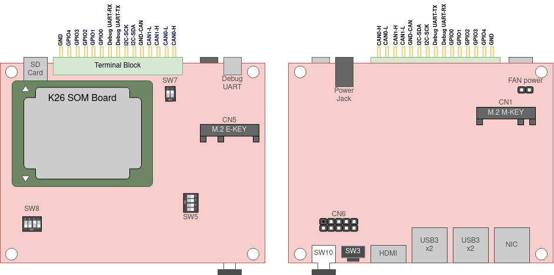
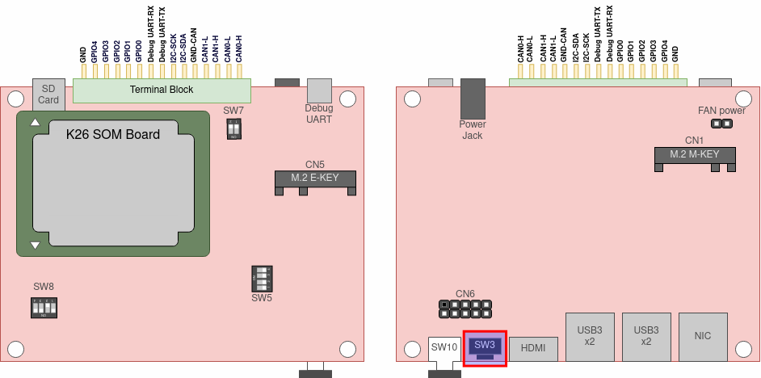
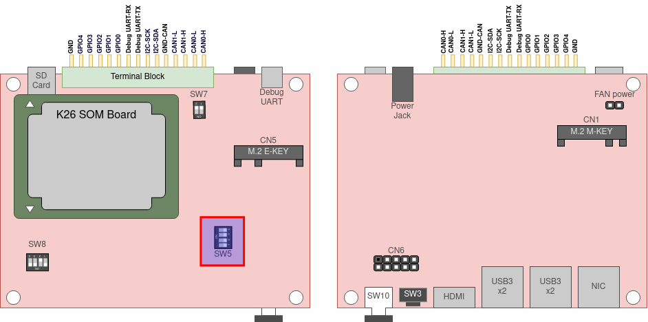
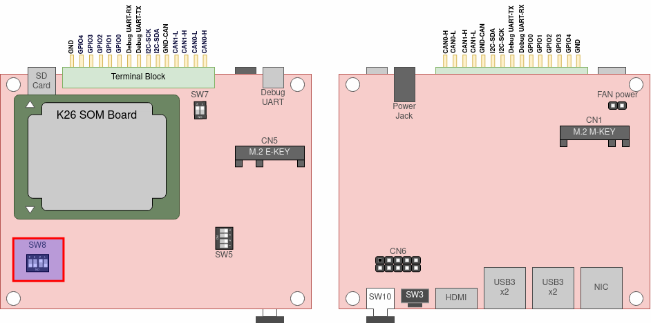
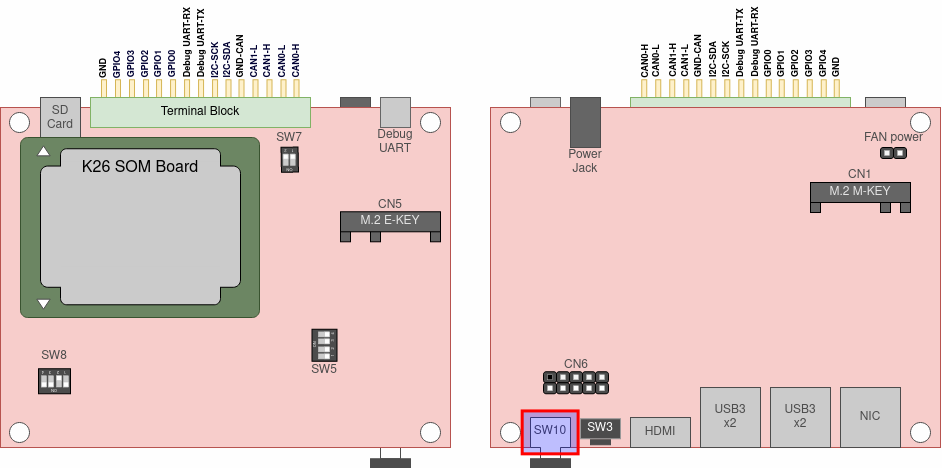
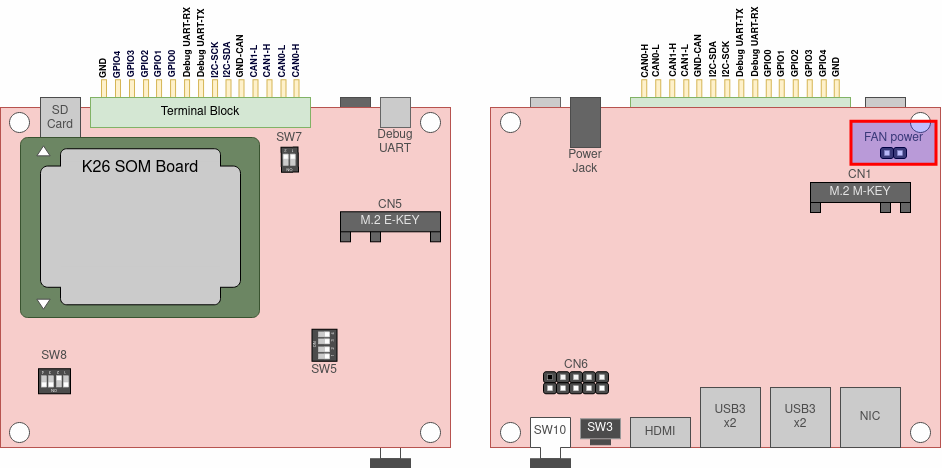

<!--
 Copyright (c) 2022 Innodisk crop.
 
 This software is released under the MIT License.
 https://opensource.org/licenses/MIT
-->

# TOC
- [TOC](#toc)
- [SOM Board Overview](#som-board-overview)
- [Devices on SOM](#devices-on-som)
  - [QSPI Flash](#qspi-flash)
  - [eMMC](#emmc)
  - [DDR4](#ddr4)
  - [TPM2.0 Security Module](#tpm20-security-module)
  - [SOC](#soc)
- [Carrier Board Overview](#carrier-board-overview)
- [IO on Carrier Board](#io-on-carrier-board)
  - [Processing System (PS)](#processing-system-ps)
  - [Programmable Logic (PL)](#programmable-logic-pl)
- [Switchs on Carrier Board](#switchs-on-carrier-board)
  - [SW3](#sw3)
  - [SW5](#sw5)
    - [SW5-1,2,4](#sw5-124)
    - [SW5-3](#sw5-3)
  - [SW7](#sw7)
  - [SW8](#sw8)
  - [SW10(LED)](#sw10led)
- [Jumpers on Carrier Board](#jumpers-on-carrier-board)
  - [Fan power](#fan-power)
  - [CN6](#cn6)
- [Debug board](#debug-board)
  - [Debug UART](#debug-uart)
  - [JTAG](#jtag)
  - [HDMI UART](#hdmi-uart)

# SOM Board Overview

# Devices on SOM
## QSPI Flash
- Size : 512MB  
    Storage for boot firmware which file name is `BOOT.BIN`.

## eMMC
- Size : 16GB  
    Storage for Images, there should be two partition `boot` and `root` in eMMC.

## DDR4
- Size : 4GB
- Speed : DDR4_2400R 

## TPM2.0 Security Module
- Vendor :　infineon

## SOC
- Part Name :  xck26-sfvc784-2lv-c 
- Zynq UltraScale+  
    This series FPGA are also called as `zynqmp`. It contain two main part:
- Processing System (PS)
  - CPU CortexA53 * 4
  - GPU Mali400
  - IO (MIO)
- Programmable Logic (PL)
  - Video codec (VCU)
  - Logic gates
  - IO (EMIO)

# Carrier Board Overview
- Version : A4

# IO on Carrier Board
There are two types of IO PS & PL on carrier board, IO which from PS will be always avalible, but IO which from PL will be only avalible when FPGA with firmware include this IO.
## Processing System (PS)
- LAN
- USB
- HDMI
- SD Card
- eMMC
- UART0
- M.2 EKEY PCIE Gen2x1
## Programmable Logic (PL)
- M.2 MKEY PCIE Gen3x4
- CAN0
- CAN1
- GPIO
- I2C

# Switchs on Carrier Board
This section introduce the function of switchs which on [the baord](#carrier-board-overview).
## SW3
- Function : Hardware reset.

## SW5
### SW5-1,2,4
- Function : IO voltage Level switch, default off for 1.8V.
### SW5-3
- Function : Power button on switch, default off for auto power on. 

## SW7
- Function : CAN BUS Terminal resistor(120ohm) switch. SW7[1] for CAN0, SW7[2] for CAN1, default off.

## SW8
- Function : Boot Mode selector, default Boot Mode is Quad-SPI (32b).  
    Boot Mode | SW8 [1:4]
    ---|---
    PS JTAG | 1111
    Quad-SPI (32b) | 1011
- For example following image shows the Boot Mode is Quad-SPI (32b).

## SW10(LED)
- Function : Power button, Power button on when SW5-3 switch to ON.

# Jumpers on Carrier Board
This section introduce the function of jumpers which on [the baord](#carrier-board-overview).
## Fan power
- Function : From left to right of following image are 12V & PWM.

## CN6
CN6 is for innoagent connection.
PIN9 | PIN7 | PIN5 | PIN3 | PIN1
---|---|---|---|---
NC | GND | GND | GND | GND |
UARTRX | UARTTX | RST | PWR | +5V

# Debug board

Debug Board include three main function:
- Debug UART
- JTAG
- HDMI UART

## Debug UART
- Baud rate : 115200
- Function : Main interactive interface for developer, it could be access by serial port utilities like minicom, putty, mobaxterm.
  
## JTAG
JTAG won't work if EEPROM on debug board didn't contain correct info.
- Function : JTAG for xilinx IDE.

## HDMI UART
Direct connect into HDMI splitter which on carrier board.
- Baud rate : 115200
- Function : Flash firmware for HDMI splitter.
